# 🚀 **ldm** · 个人魔改版 AstrBot

> **高度定制 · 拒绝官方覆盖**  
> 基于官方 [AstrBot](https://github.com/AstrBotDevs/AstrBot) v4.26.5–4.26.7 修复合入 · 二次修改 · 当前 ldm 版本 **v4.26.19**

---

## 📥 一键安装（推荐）

在终端执行以下命令，自动下载并运行安装脚本：
### 方式1：一键下载并执行
```bash
curl -fsSL -o ldmbot_install.sh https://github.com/landamao/ldm_AstrBot/releases/latest/download/ldmbot_install.sh && chmod +x ldmbot_install.sh && ./ldmbot_install.sh
```
### 方式2：先下载再执行
  - 第一步：下载脚本
    - 方式1
    ```bash
    curl -fsSL -o ldmbot_install.sh https://github.com/landamao/ldm_AstrBot/releases/latest/download/ldmbot_install.sh && chmod +x ldmbot_install.sh
    ```
    - 方式2（代理加速）
    ```bash
    curl -fsSL -o ldmbot_install.sh https://gh-proxy.org/https://github.com/landamao/ldm_AstrBot/releases/latest/download/ldmbot_install.sh && chmod +x ldmbot_install.sh
    ```
  - 第二步：执行脚本
    ```bash
     ./ldmbot_install.sh
    ```

### 脚本选项：
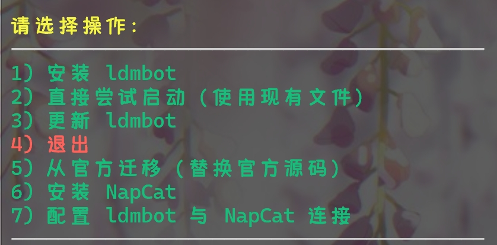


> 如需**手动安装**（分步控制），请跳转到文档末尾的 [📄 手动安装教程](#-手动安装教程)。

---


# ✨ 功能特性
## 1. /help指令回归旧版，再也不是新版本后的英文版，仅几个指令
   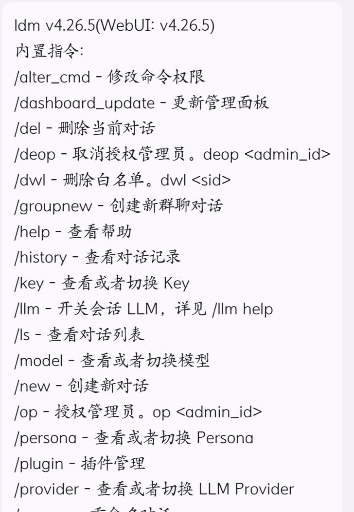
## 2. /plugin指令新增restart和update，可快速重启和更新插件
   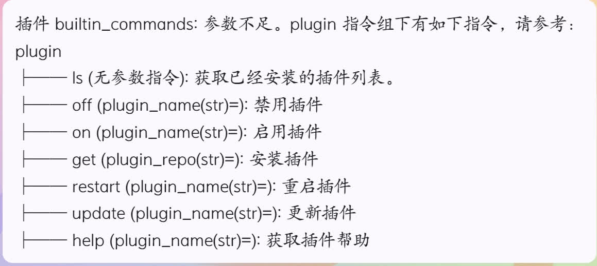
## 3. /llm指令会话级开关，可以单独开关某个会话的llm功能啦
   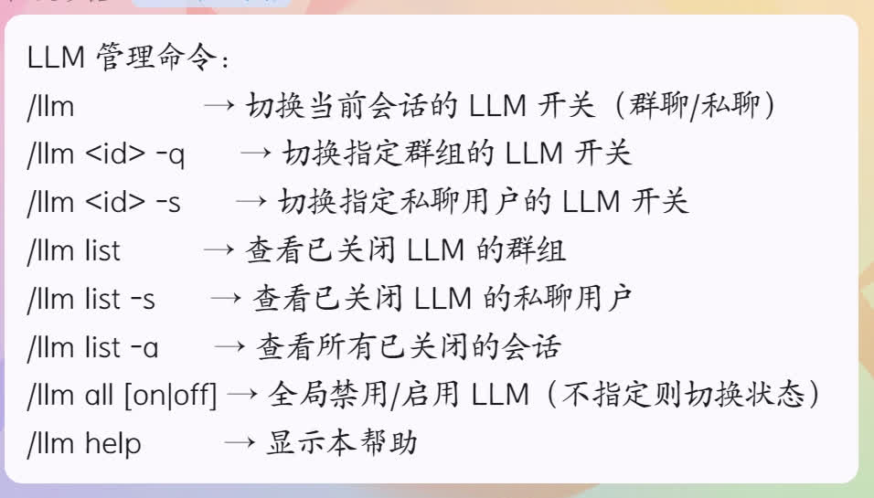
## 4. 启动时端口被占用可以交互式修改端口号，再也不用去手动编辑复杂的配置文件
   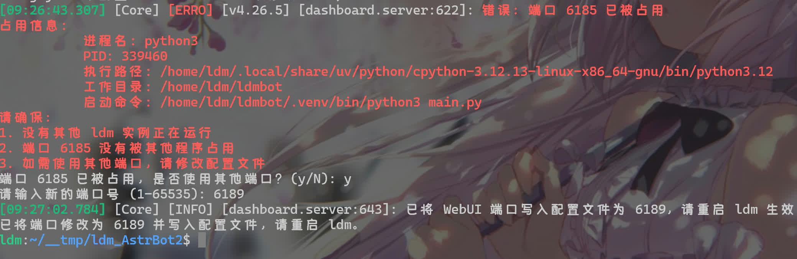
## 5. 初次使用用户名密码均为ldm，且登录后无强制修改，去除用户名和密码的任何限制，仅非空限制

# 🎨 WebUI特性：
## 1. 补全插件查看更新文档，作者信息
   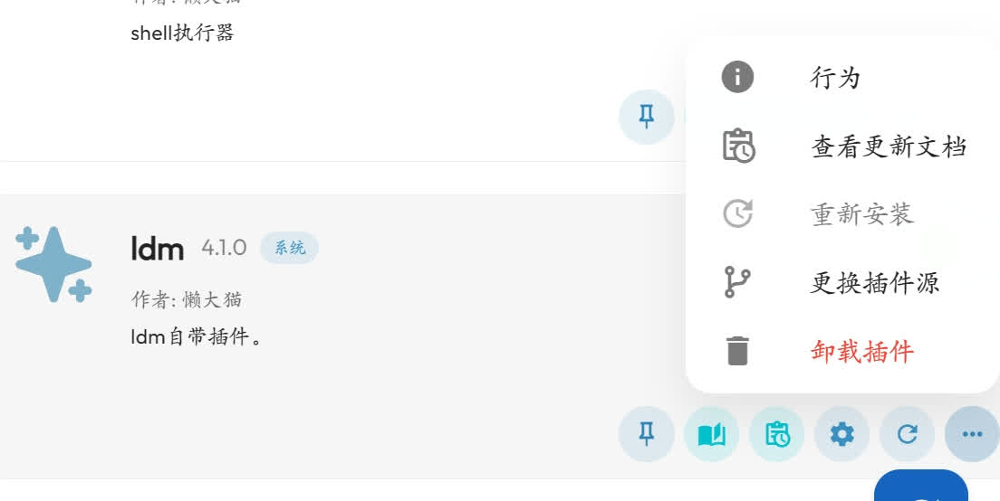
## 2. 侧边栏默认顺序调整，更符合使用习惯，点击频率
   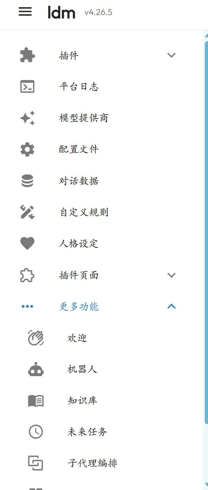
## 3. 插件加载失败新增`更新`按钮，有些插件新版本可能已经修复了问题
   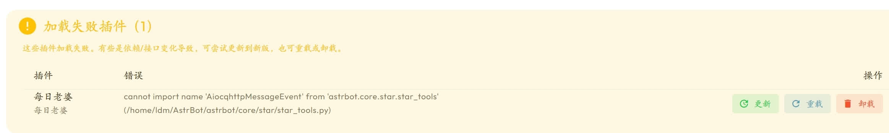
## 4. 配置文件→模型配置，将主次模型改成`对话模型链`，可拖拽调整顺序，无需修改两个地方
   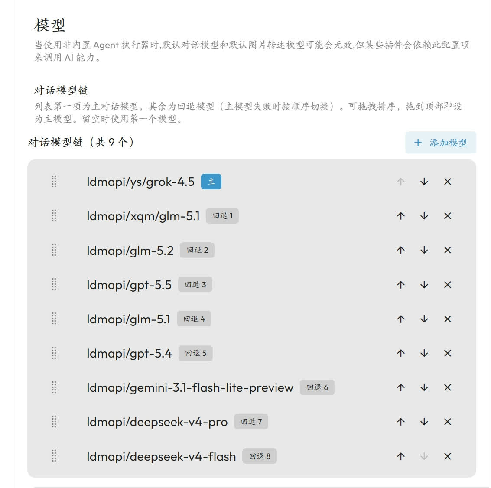
## 5. `添加对话模型`新增搜索模型，无需翻找大量模型列表
   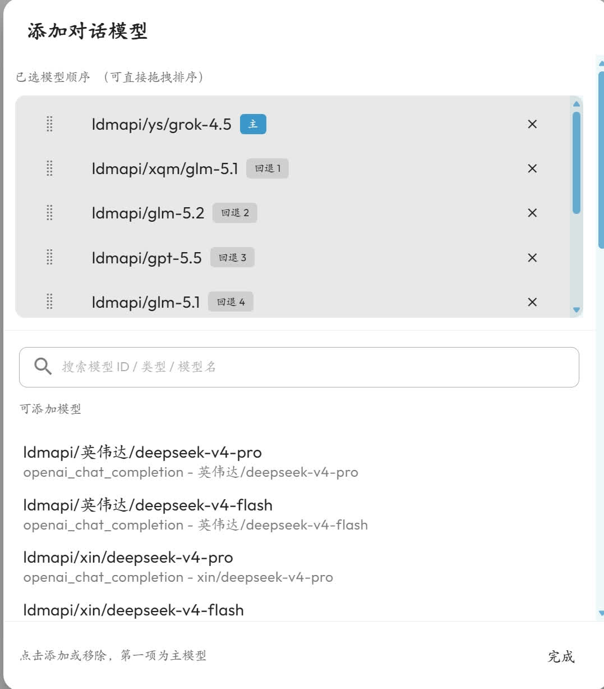
## 6. 备份恢复可任意版本，4.xx.xx版本恢复数据无需担心数据版本问题
   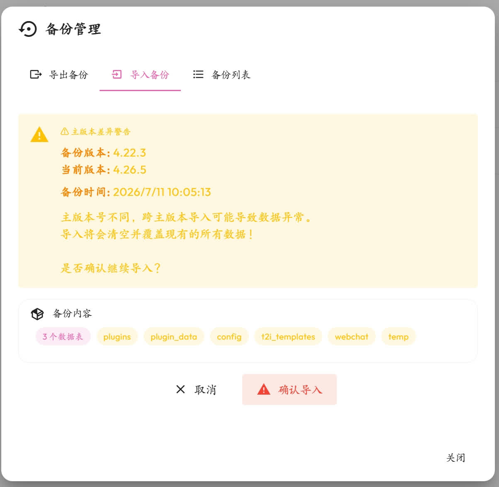
## 7. 配置文件→扩展功能大升级，升级分段回复，参考插件`对话分段Pro`(https://github.com/nuomicici/astrbot_plugin_splitter) 融合
   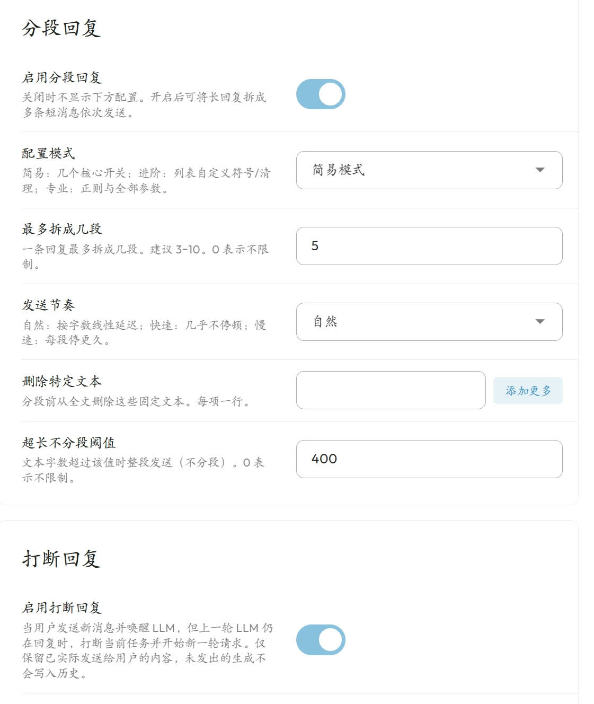
## 8. 配置文件→扩展功能，新增`打断回复`功能，与框架自带分段配合，用户体验拉满
   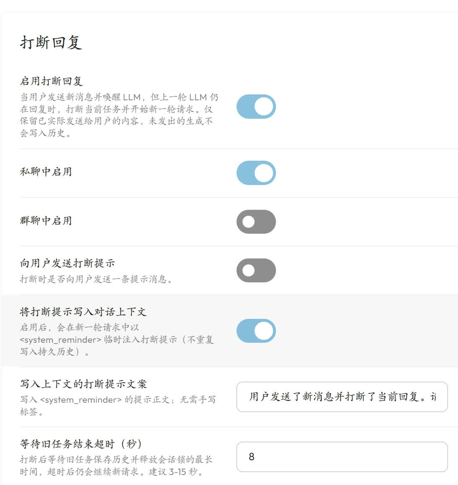

   **灵感来源**：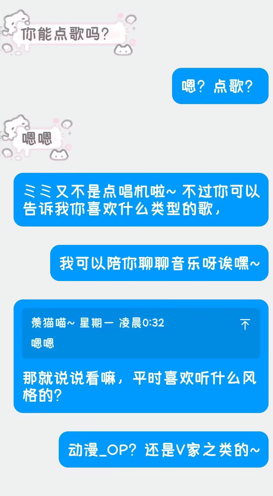
   - 详解：原来会暂停用户窗口，等待上一个回复完成，再把新消息请求llm，现在用户发新消息，立即打断，重新请求llm，
     新旧消息不会消失，分段已回复内容记入对话历史，与实际聊天记录基本保持一致
### 9. 定制版WebUI界面，LOGO改为松坂砂糖头像，名字改为ldm
### 10. 去除了astrbot、webui更新
### 11. 日志颜色改为亮色，info日志改为绿色，黑色背景下观感更好，原来黑色背景加暗色字体，看日志极费眼力

## 📄 手动安装教程

> 以下步骤基于 `ldmbot_install.sh` 脚本的逻辑，适合希望完全掌控每个环节的用户。

### 1. 下载安装脚本
```bash
wget https://github.com/landamao/ldm_AstrBot/releases/latest/download/ldmbot_install.sh
# 或 curl
curl -LO https://github.com/landamao/ldm_AstrBot/releases/latest/download/ldmbot_install.sh
```

### 2. 赋予执行权限
```bash
chmod +x ldmbot_install.sh
```

### 3. 运行脚本（自动解压 + 环境配置）
```bash
./ldmbot_install.sh
```

常用参数：

```bash
./ldmbot_install.sh -up -ns   # 推荐：更新程序，不同步依赖
./ldmbot_install.sh -up       # 更新程序，并同步依赖
./ldmbot_install.sh -ns       # 安装/启动，不同步依赖
./ldmbot_install.sh -y        # 非交互安装
```

脚本会自动执行以下操作：
- 从 GitHub Releases 下载 `ldmbot.zip` 并解压到当前目录
- 检测本地代理（端口 `7890` 或 `7897`），询问是否启用
- 检查 `uv` 包管理器，若缺失则自动安装
- 默认优先使用 `uv sync` 安装依赖并启动；加 `-ns` 则跳过依赖同步，直接 `uv run main.py`
- 若 `uv` 失败，回退到 `pip`：自动创建 Python 3.12 虚拟环境，安装 `requirements.txt` 并启动（`-ns` 同样跳过 pip 安装）

### 4. （可选）手动解压部署与启动
若只想解压不自动启动，可直接下载源码包后解压：
```bash
curl -fsSL -o ldmbot.zip https://github.com/landamao/ldm_AstrBot/releases/latest/download/ldmbot.zip
unzip ldmbot.zip -d .
cd ldmbot
```
- **部署**
使用uv（推荐）
  ```bash
  uv sync  # 同步依赖
  ```
  ```bash
  uv run main.py  # 启动 （后续启动）
  ```
- **使用 pip**：
  ```bash
  python3.12 -m venv .venv
  source .venv/bin/activate
  pip install -r requirements.txt
  python main.py
  ```

### 5. 后续维护
- 再次执行同一安装脚本，会检测到已存在 `ldmbot` 目录，提供 **直接启动** / **删除重建** / **重命名重建** / **更新** / **覆盖解压** 选项。
- **推荐更新方式**：`./ldmbot_install.sh -up -ns`  

### 6. 反馈交流
- qq群 1103659691 [点击跳转](https://qm.qq.com/q/c7Nc3Tl1Je) (https://qm.qq.com/q/c7Nc3Tl1Je)
- telegram [@landamaogroup](https://t.me/landamaogroup) (https://t.me/landamaogroup)
---

## 📜 许可 & 文档维护

- 上游遵循 **AGPL v3**（见 `LICENSE` / `EULA.md`）  
- 本说明仅描述**个人魔改行为**，非官方分支


- [AstrBot](https://github.com/AstrBotDevs/AstrBot) (https://github.com/AstrBotDevs/AstrBot)
- [ldm_AstrBot](https://github.com/landamao/ldm_AstrBot) (https://github.com/landamao/ldm_AstrBot)